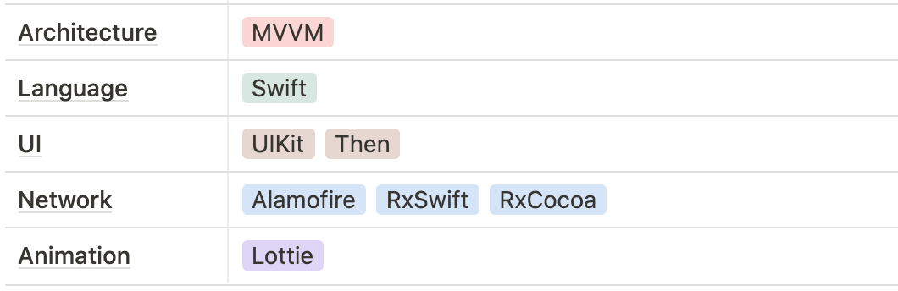

# LiVRE
* 네이버 검색 Open API와 키워드 분석 API를 사용한 책 검색 애플리케이션
* ❗️프로젝트를 실행하기 위해서는 API key 정보가 담긴 SecretKeySet.swift 파일이 필요합니다.
* 기획 및 디자인 : 1/14 ~ 1/17
* 개발 기간 : 1/17 ~ 1/29
* 피드백 참여 : [KimKwon](https://github.com/KimKwon)

## Technology Stack

## ScreenShot

## 피드백 반영
### 책 목록 아이템에서 작가명 부분에 html 태그 나오는 현상 제거

## Reference
* 책 검색 API : [네이버 검색 Open API](https://developers.naver.com/docs/search/book/)
* 블로그 검색 API : [네이버 검색 Open API](https://developers.naver.com/docs/search/blog/)
* 뉴스 검색 API : [네이버 검색 Open API](https://developers.naver.com/docs/search/news/)
* 쇼핑 검색 API : [네이버 검색 Open API](https://developers.naver.com/docs/search/shopping/)
* 키워드 분석 API : [AI Cloud Open API](https://www.saltlux.ai/)
