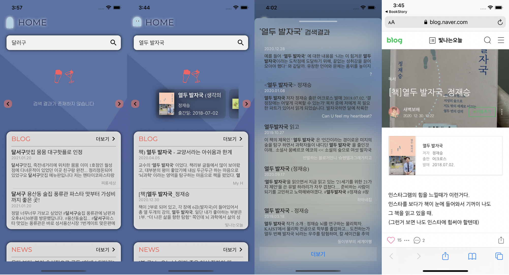

# iOS_BookStory
* 네이버 검색 Open API를 사용한 책 검색 애플리케이션
* 기획 및 디자인 : 1/14 ~ 1/17
* 개발 기간 : 1/17 ~

## Technology Stack

## ScreenShot

## Reference
* 책 검색 API : [네이버 검색 Open API](https://developers.naver.com/docs/search/book/)
* 블로그 검색 API : [네이버 검색 Open API](https://developers.naver.com/docs/search/blog/)
* 뉴스 검색 API : [네이버 검색 Open API](https://developers.naver.com/docs/search/news/)
* 쇼핑 검색 API : [네이버 검색 Open API](https://developers.naver.com/docs/search/shopping/)
* 키워드 분석 API : [AI Cloud Open API](https://www.saltlux.ai/)
